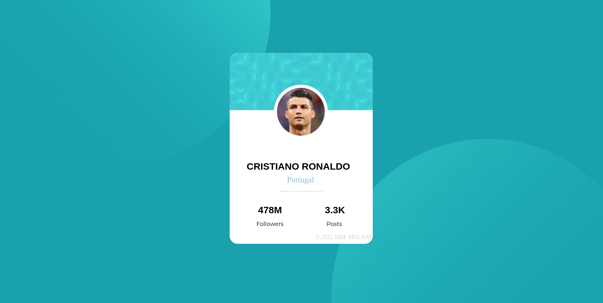
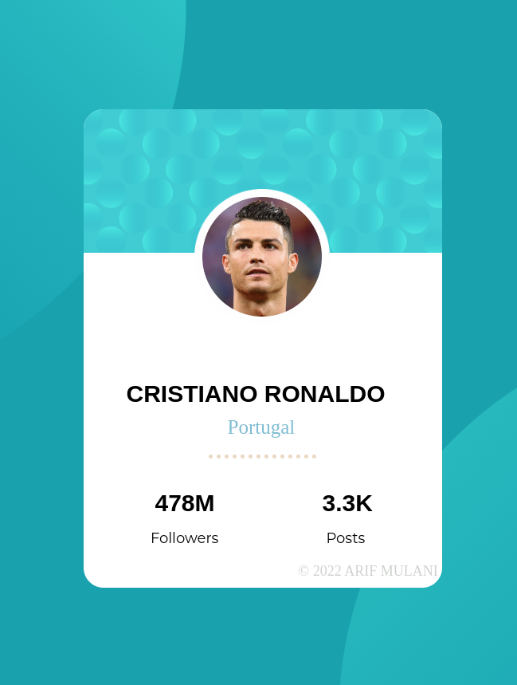

# Frontend Mentor - Profile card component solution

This is a solution to the [Profile card component challenge on Frontend Mentor](https://www.frontendmentor.io/challenges/profile-card-component-cfArpWshJ). Frontend Mentor challenges help you improve your coding skills by building realistic projects.

## Table of contents

- [Overview](#overview)
  - [The challenge](#the-challenge)
  - [Screenshot](#screenshot)
  - [Links](#links)
- [My process](#my-process)
  - [Built with](#built-with)
  - [What I learned](#what-i-learned)
  - [Continued development](#continued-development)
  - [Useful resources](#useful-resources)
- [Author](#author)
- [Acknowledgments](#acknowledgments)


## Overview

In this Project I made Profile Card from given skeleton HTML file. I created my own CSS file and made some changes in content (There was a random guy instead of him I used Ronaldo).

### The challenge

- Build out the project to the designs provided.

### Screenshot





### Links

- Solution URL: [GitHUb Solution](https://github.com/mulani-arif/Profile-Card-project-1)
- Live Site URL: [Live Site](https://mulani-arif.github.io/Profile-Card-project-1/)

## My process

First I connected the required links. In body I kept Body on relative positioning and two circular images in background on absolute positioning and created such a beautiful texture. Next I made a division (class name "middle"). First roughly made a rectangle and tried to align it in middle by changing its positions and then I added Card Pattern and made all corners circular. Then added image of Ronaldo and a white circle slightly bigger than Ronalo's image and aligned it in such a way that it will give a beautiful backround to actual image.
   for dotted line you can check it from css file it is just some modification in horizontal line.

### Built with

- HTML5 markup
- CSS
- Color Hunt
- Google Fonts

### What I learned

I learned alot about Display and Positioning. How to align child with respect to it's Parent.

```html
<h1>Some HTML code I'm proud of</h1>
<br>

 
 <br>
```
```css
body{
  margin:0;
  position: relative;
  font-size: 18px;
/*  background-image: url("https://images.pexels.com/photos/1831234/pexels-photo-1831234.jpeg?cs=srgb&dl=pexels-madison-inouye-1831234.jpg&fm=jpg");*/
background-color: hsl(185, 75%, 39%);
}
.top-pattern
{
 position:absolute;
 right:55%;
 bottom: 40%;

}
.bottom-pattern
{
  position:absolute;
  left:55%;
  top:45%;

}
```

### Continued development

I want to focus on Display and Positioning in future projects. Still not fully comfortable with those concepts. I found chrome,s Developer tool very helpful and its box model too.
I want to be perfect in it.


### Useful resources

- [Google Fonts](https://fonts.google.com/) - This helped me for exploring lot's of Fonts. I really liked this and will use it going forward.
- [W3schools](https://www.w3schools.com/css/) - This is an amazing article which helped me finally understand rounding specific corners and aligning too much things correctly. I'd recommend it to anyone still learning this concept.

## Author

- Frontend Mentor - [@mulani-arif](https://www.frontendmentor.io/profile/mulani-arif)
- Twitter - [@array__if](https://www.twitter.com/array__if)
- GitHub - [mulani-arif](https://github.com/mulani-arif)

## Acknowledgments

I would Love to appreciate the teaching method of Angela Yu. I've learned too much in short span of time and I explored lots of new things due to her. Thanks to all authors and creators out there who are easing the task.
